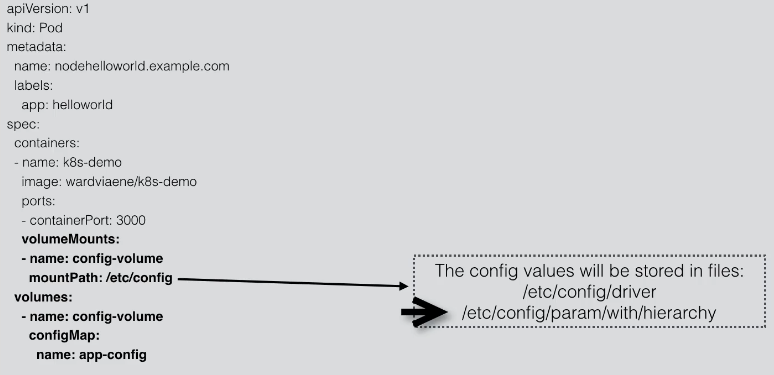
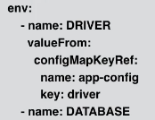
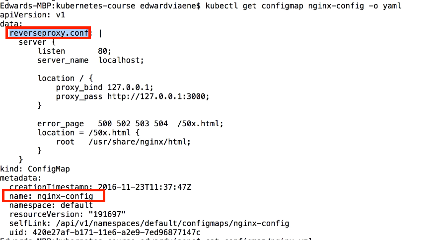
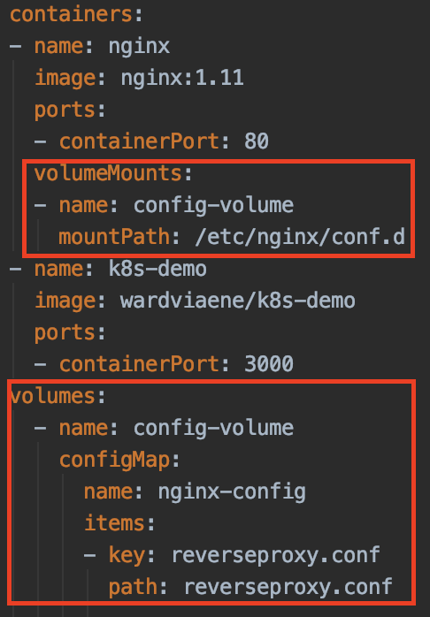

#Config Map
https://www.udemy.com/course/learn-devops-the-complete-kubernetes-course/learn/lecture/6089378#overview

Configuration parameters that are not secret, not like credentials, can be put in ConfigMap

- Key-value pairs

- Config key-value pairs can then be read by app using as 

    - "Environment variable", 
    - "Container commandline arguments"
    - "Volumes"
   
ConfigMap can also contain full configuration files e.g. an webserver config file.
The file can be mounted using volumes where the application expects its config file, 
"inject" the configuration without changing the container itself
       
A command to create the config map

    kubectl create configmap app-config --from-file=app.properties
    
Then expose the configmap using a volume (see demo)
    


If we have the property name "driver", 
then in the volume it will have a file named "driver" with value in it.

Alternatively, if using the environment variables, then in the container config:



## Demo
Setup a reverse proxy (proxy with single endpoint and resolve to different server).
This will put the reverseproxy configuration file (reverseproxy.conf)

```
server {
    listen       80;
    server_name  localhost;

    location / {
        proxy_bind 127.0.0.1;
        proxy_pass http://127.0.0.1:3000;
    }

    error_page   500 502 503 504  /50x.html;
    location = /50x.html {
        root   /usr/share/nginx/html;
    }
}
```

Create the configmap

    kubectl create configmap nginx-config --from-file=configmap/reverseproxy.conf
    
Check the configmap is created

    kubectl get configmap
    
Get the configmap object in yaml

    kubectl get configmap nginx-config -o yaml

    
where the key is "reverseproxy.conf"

In the service yml, define the item to lookup. 



So the key matched "reverseproxy.conf" and the file will be put as path ("reverseproxy.conf") as well.
This file will be mounted under /etc/nginx/conf.d

Create the pod and services

    kubectl create -f configmap/nginx.yml
    kubectl create -f configmap/nginx-service.yml

Once pod is ready, look into the pod

    kubectl exec -i -t helloworld-nginx -c nginx -- bash 
    
    

