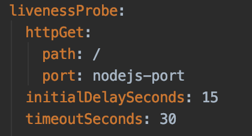
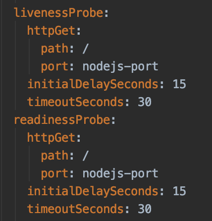
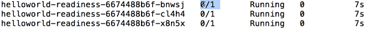

# Health Check
Udemy: https://www.udemy.com/course/learn-devops-the-complete-kubernetes-course/learn/lecture/6077418#overview

## Define the livenessProbe
Define the health check endpoint in the deployment

LivenessProbes: Indicate whether a container is running. If failed, container can be restarted.

    kubectl create -f deployment/helloworld-healthcheck.yml

## Define the readinessProbe

ReadinessProbe: Indicate whether a container is ready to serve request. 
If failed, the container will not be restarted but the Pod's IP address will be removed from the service.
It make sure pod, at startup, will only receive traffic when the test succeeds. 

So with this readiness probe, we can see something like below. That even the status is "running" but the ready is still 0.

         