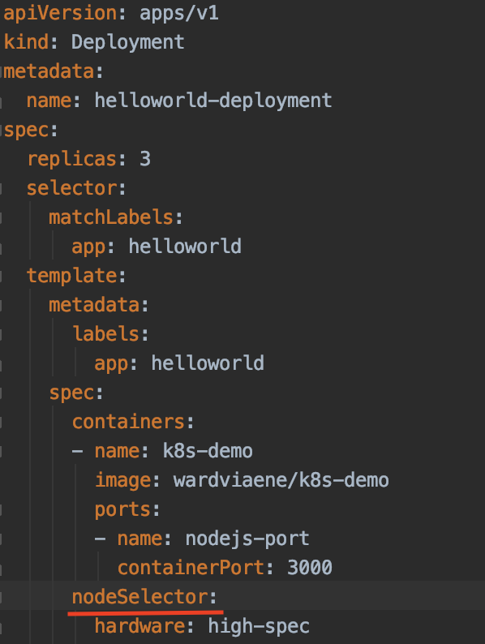

# Nodeselector using labels

## Specify the nodeSelector in the deployment

The deployment specify above saying this pod have to find node which has label (hardware:high-spec)

We can check the nodes and its labels by 

    kubectl get nodes --show-labels
    
If no node fit the requirement, it will return message (failed to fit in any node)    

## To update the label on node

    kubectl label nodes <node_name> <label1=value1>
    
e.g. 

    kubectl label nodes minikube hardware=high-spec
