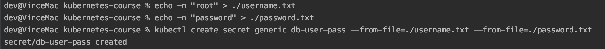
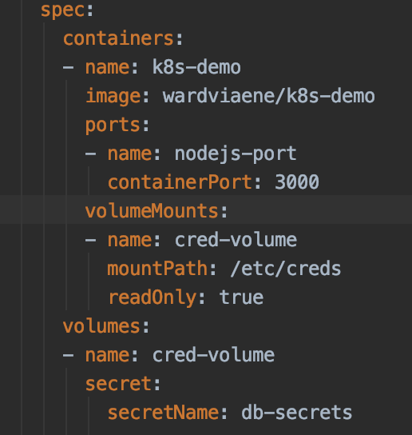
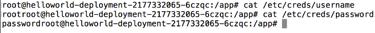

# Secrets

https://www.udemy.com/course/learn-devops-the-complete-kubernetes-course/learn/lecture/6078636#overview
https://www.padok.fr/en/blog/kubernetes-secrets

- To distribute credentials, keys, passwords, or secret "data" to pods
- To access the internal API or applications
- Secrets is one way native to Kubernetes and there still other ways (such as external vault)

## Secret how to ?
- As environment variables
- As file in a pod
    -  Uses volume to be mounted in a container. Files in this volume.
    -  Can be used for instance for dotenv files (for about dotenv, refer here : https://dev.to/getd/how-to-manage-secrets-and-configs-using-dotenv-in-node-js-and-docker-2214)
- As external image to pull secrets

## Create the secrets using files
Create the secrets using files, for example

    echo -n "root" > ./username.txt
    echo -n "password" > ./password.txt
    kubectl create secret generic db-user-pass --from-file=./username.txt --from-file=./password.txt

Or a secret can be SSH Key or an SSL certificate key
    
    kubectl create secret generic ssl-key-cert --from-file=ssl.key --from-file ssl.cert
    
(Refer: https://www.padok.fr/en/blog/kubernetes-secrets)    
(generic means the secret was created from a local file)

We can also create the secret via the yml file (like helloworld-secrets.yml), which values are base64 of the orig value.

## How to use secret
In the pod definition, we specify like follow if exposes the secrets as environment variables.

    env:
    - name:SECRET_USERNAME
        valueFrom:
            name: db-secret
            key: username
      
Or if mount as volume (as shown in below demo)

## Demo

Create the secret via helloworld-secrets.yml, a secret named "db-secrets" is created.
Create the deployment via helloworld-secrets-volume.yml, 
    

Once the deployment is done, access the shell of the pod 

    kubectl exec <pod_name> -i -t -- /bin/bash

and inside the pod can see the file is mounted 

