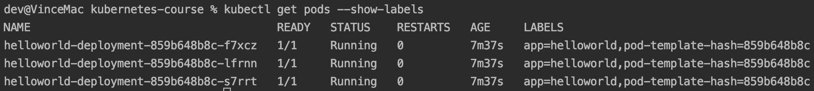
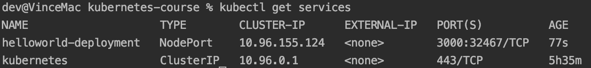
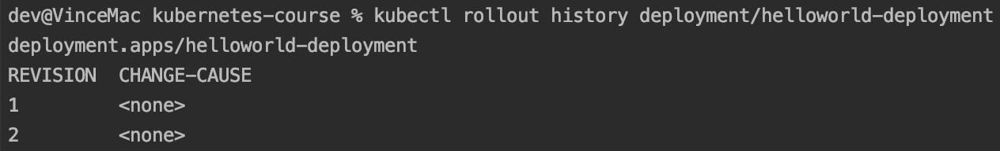

# Deployment

Similar to replicat-set / replication-controller, 
but with additional concern on the deployment strategy
(such as rolling update, max surge or max unavailabile during update etc.), 
so it is recommended over directly use the replicat-set.

## Create deployment
Create the deployment with 3 replicas (pods)

    kubectl create -f deployment/helloworld.yml
    
Get the deployment show it running

    kubectl get deployments
    
Can also see replica-set is created 

    kubectl get rs

And pods 

    kubectl get pods --show-labels
    
    
 
## show deployment status

    kubectl rollout status deployment/helloworld-deployment

shows deployment "helloworld-deployment" successfully rolled out

## Expose the deployment with services

    kubectl expose deployment helloworld-deployment --type=NodePort

## Get the service (find the port exposed)

    kubectl get services 
    
        
    
In the example, it shows the port is 32467 automatically assigned

If we are using the minikube, we can get the url using

    minikube service helloworld-deployment --url
    
## Change the image of the deployment
By specify the container name and the new image (with tag)

    kubectl set image deployment/helloworld-deployment k8s-demo=wardviaene/k8s-demo:2
    
It then show the deployment image updated

## Show the rollout history

    kubectl rollout history deployment/helloworld-deployment

## Undo the rollout
We can undo the rollout for last run

    kubectl rollout undo deployment/helloworld-deployment

Or even to a specified revision

     kubectl rollout undo deployment/helloworld-deployment --to-revision=3
    
Please note: The revision will also increased even the rollout is undo

## Edit the deployment         
We can also edit the deployment (for example, update the revisionHistoryLimit to 100) 

    kubectl edit deployemnt/helloworld-deployment
    
## Delete the deployment and service (for clean up)  

    kubectl delete deployment helloworld-deployment
    
    kubectl delete service helloworld-deployment
    
    