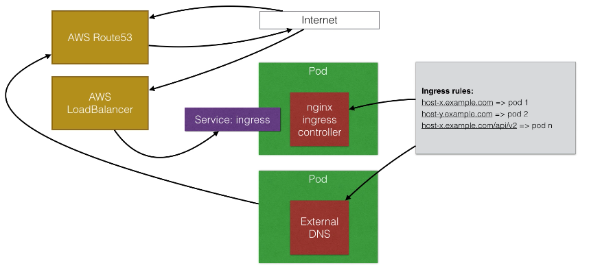
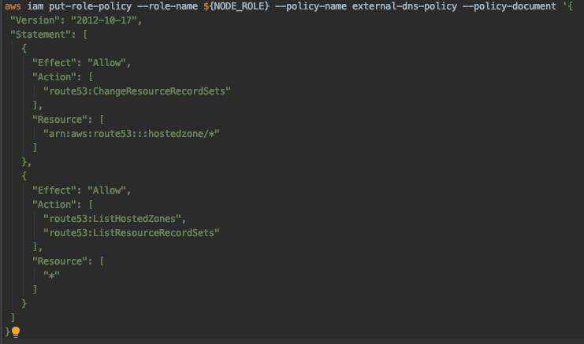
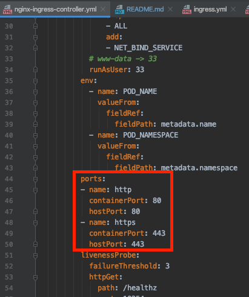

# External DNS

Project page: https://github.com/kubernetes-incubator/external-dns
https://www.udemy.com/course/learn-devops-the-complete-kubernetes-course/learn/lecture/11335228#overview

## Description 
- External DNS is used along with the ingress.
- It will automatically create the necessary DNS records in external DNS Server (e.g. route53)
- Every hostname that use in ingress, external DNS will create a new record to send traffic to load balancer

## How it works
- Two pods in cluster, one is with nginx ingress controller, another is with external DNS.
- One service is setup in front of ingress controller container, as a load balancer
- This service is a kind of load-balancer type (not clusteredIP / NodePort)
- Ingress rules are configured, and read by both ingress controller and external DNS
- External DNS will create record in the DNS provider (e.g. AWS route53)
- While client come in from Internet, it get IP address of hostname from the DNS provider. 
  And the IP address will be of the load balancer.
- Load balancer will connect to the ingress service. 
  Ingress service will redirect the traffic to ingress conrtorller
- Ingress controller will read the rule and see which route to forward request




## Create IAM Policy
Give permission to node (role in term of AWS) to create DNS records.
Currently it is node basis instead of pod basis.
Note: Change the Node-role to cluster name
```
./put-node-policy.sh
```


## start ingress
Apply the ingress controllers, and also the helloworld v1,v2 and echo server for default) 
```
kubectl apply -f ../ingress/
```
Since we have load balancer in front of the service, 
we can remove the setting for nodeport inisde the nginx-ingress-controller



## Create LoadBalancer for Ingress
```
kubectl apply -f service-l4.yaml
```

## Create external DNS and ingress rules
```
kubectl apply -f external-dns.yaml
kubectl apply -f ingress.yaml
```
