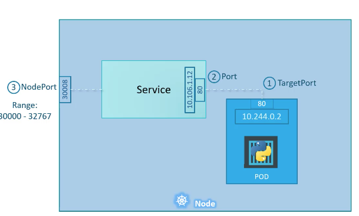
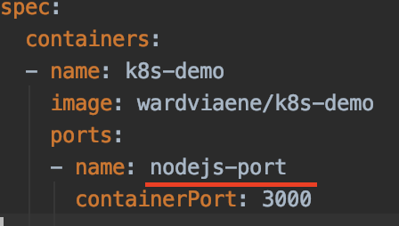
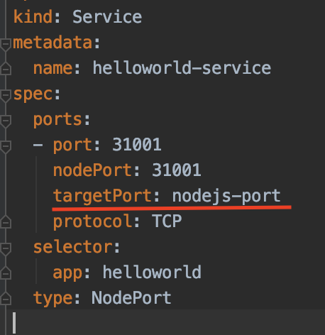
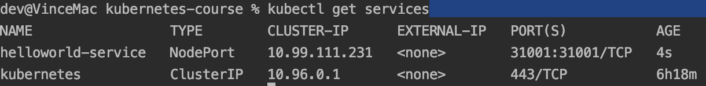
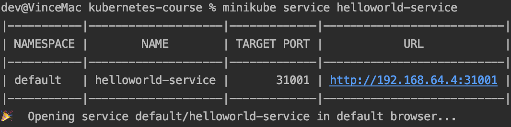
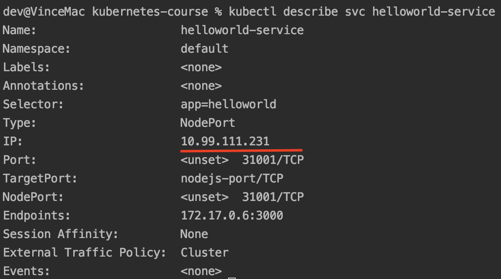

# Service for deployment

## Definition of port

- TargetPort: Actual port on which your application is running inside the container.
- Port (mandatory). Port on the service. Treat service as a virtual server inside the node. 
- NodePort: Allow access outside the node to access via the service which forward request to pod. Only range from 30000 to 32767)
   
    
More info : https://www.udemy.com/course/certified-kubernetes-application-developer/learn/lecture/12299468#overview

## Create the pod 

    kubectl create -f first-app/helloworld.yml
    
Note that the port inside the definition have a name (nodejs-port), which will be used for the service
    
       
    
Pod should start running. 
     
## create the nodeport service

    kubectl create -f first-app/helloworld-nodeport-service.yml

When seeing this yml, we can find it define a target port

       
    
Will open service which bridge the node port 31001 to the container 3000 port

   

Since it is to be run in minikube, we can trigger the browser by

    minikube service helloworld-service --url

The url is something like http://192.168.64.4:31001 which is an ip address

## Get info of service

    kubectl describe svc helloworld-service

We can see an endpoint there which can be used inside the cluster.

Note: if we delete the service and create again, the IP address show above will be changed 
(unless we define a static IP)

