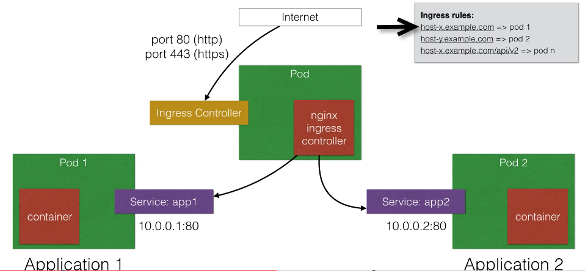

# Ingress

https://www.udemy.com/course/learn-devops-the-complete-kubernetes-course/learn/lecture/6090424#overview

Ingress is used to allow inbound connections to the cluster.

It is an alternative to the external Loadbalancer and nodePorts.
   - Ingress allows you to easily expose services that need to be accessible from outside to the cluster
    
With ingress you can run your own ingress controller (basically a loadbalancer) within the kubernetes cluster
There are a default ingress controllers (nginx ingress controller) available, or write own ingress controller

## How it works



Forward the traffic follow rules based on the path

A classic example of ingress is shown below

```
apiVersion: extensions/v1beta1
kind: Ingress
metadata:
  name: helloworld-rules
spec:
  rules:
  - host: helloworld-v1.example.com
    http:
      paths:
      - path: /
        backend:
          serviceName: helloworld-v1
          servicePort: 80
  - host: helloworld-v2.example.com
    http:
      paths:
      - path: /
        backend:
          serviceName: helloworld-v2
          servicePort: 80
```

