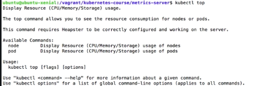
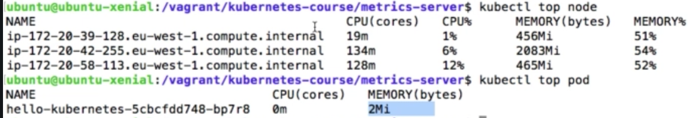

# Metrics Server 
Show case for daemon sets

https://www.udemy.com/course/learn-devops-the-complete-kubernetes-course/learn/lecture/6112146#overview

## Daemon Set
- Ensure every single node in the cluster run the same pod resource
- When a node is added to the cluster, a new pod will be started automatically
- When a node is removed from the cluster, the pod will NOT be scheduled to another node
- Always have the same amount of pod to the same amount of nodes

## Typical use case of daemon set
- Logging aggregators (where the pod send their logs to )
- Monitoring 
- Load balancers, reverse proxies, api gateway (like linkerd)
- Running a deamon that only need one instance per physical instance

## Configuration for daemon set
Change the resource type to "ReplicaSet"

## Metrics Server
Replacement of the Heapster (which is deprecated)
- Metrics Serverr enables Container cluster monitoring and performance analysis
- Use third party tool like prometheus to show external metrics
- URL : https://github.com/kubernetes-sigs/metrics-server

## Demo
To create the metric server and other resources

    kubectl create -f metrics-server
     
Then we can run the kubectl top to display the usage

    kubectl top     
    
     

To display the top node / top pod

    kubectl top node
    kubectl top pod
    
         
    
    
## Follow up
The approach to export data to influxDB / Grafana is not covered 
in the demo for metrics-server (while it is a feature in its ancestor Heapster)