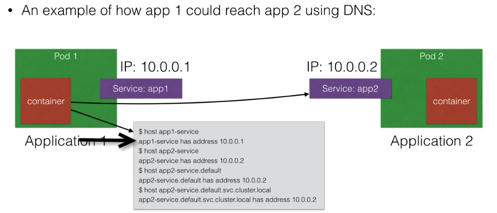
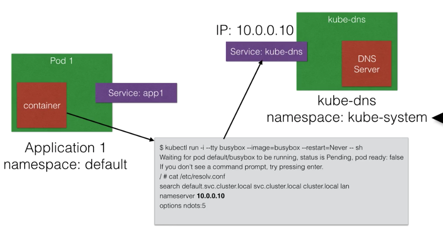
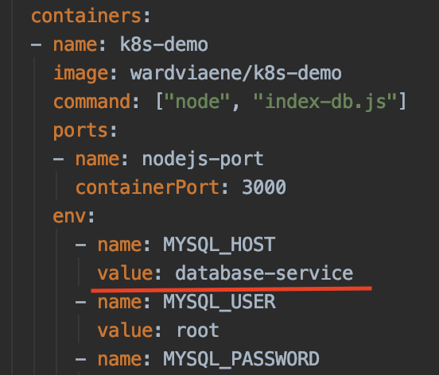
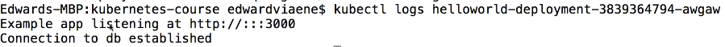
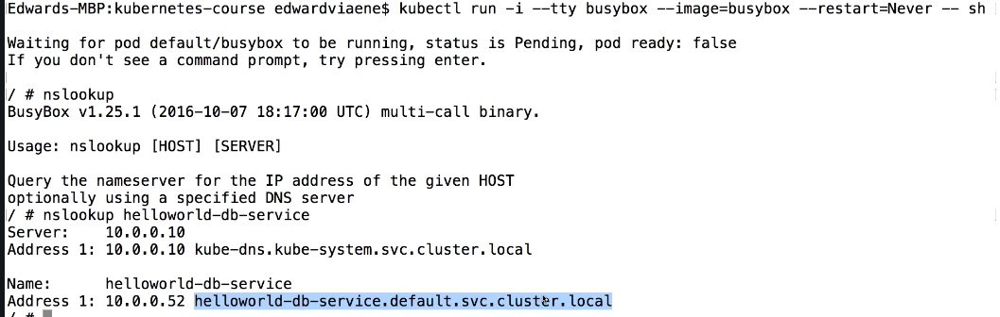

# Service Discovery
https://www.udemy.com/course/learn-devops-the-complete-kubernetes-course/learn/lecture/6088612#overview

DNS is a built-in service launched automatically using the addon manager.

Addons are in the /etc/kubernetes/addons on master node

DNS service can be used within pods to find other services running on the same cluster

Multiple containers within 1 pod don't need this service, as they can contact each other directly

A container in the same pod can connect the pod of other container directly using localhost:port
To make DNS work, a pod will need a service definition.



- If the service are in same namespace, just lookup the service by name like 'app1-service'
- If the service is in another namespace, then need to specify the full host name. 
The full host name is name of service.namespace.svc.cluster.local (e.g. app2-service.default.svc.cluster.local)

## How to work



When the container start, the resolv.conf is updated 
so its point to the nameserver which is actually the kube-dns 
(which is service exposed in kube-system namespace)

## Demo
Create the secrets for database

    kubectl create -f service-discovery/secrets.yml
    
Create the database. In the config, see the name is "database" 

    kubectl create -f service-discovery/database.yml

Next create the database service. It has selector for pod with label (app:database)

    kubectl create -f service-discovery/database-service.yml
    
Then we deploy the application which will use the database.

    kubectl create -f service-discovery/helloworld-db.yml
 
Here you can see the container lookup the environment variable. And this is used inside the app. 
    
 

Finally, create the service for the application

    kubectl create -f service-discovery/helloworld-db-service.yml
    
In minikube, we can run following to get the service url

    minikube service helloworld-db-service --url
    
Check the log of pod to see if the app start 

    kubectl get pod
    kubectl logs <pod-name>
    
     
    
Once check if it is fine. Visit the url few times. Which will return message like

```text
Hello World! You are visitor member <cnt>
```

To check the database, open the shell to the database pod and login the mysql

    kubectl exec database -i -t -- mysql -u root -p
    
If now we open a new pod (e.g. busybox) and login the shell and check the resolver, it show something like this

    kubectl run -i -tty busybox --image=busybox --restart=Never --sh 

     