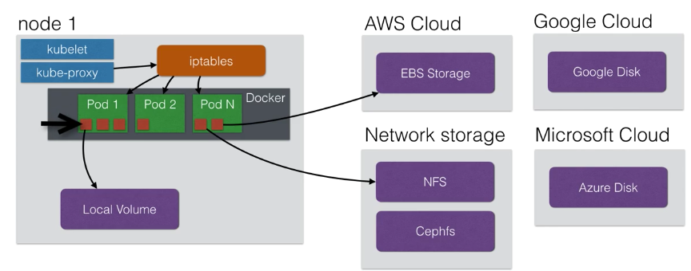
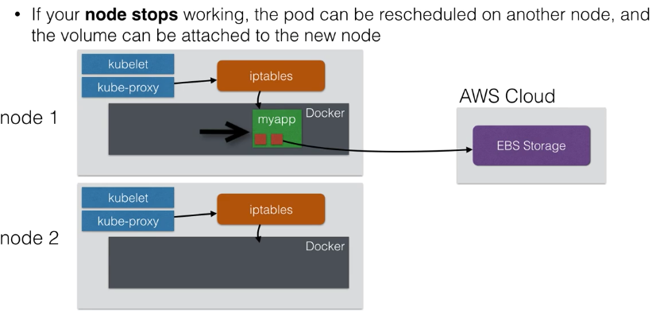
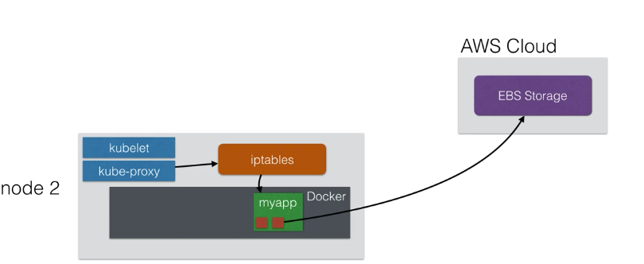
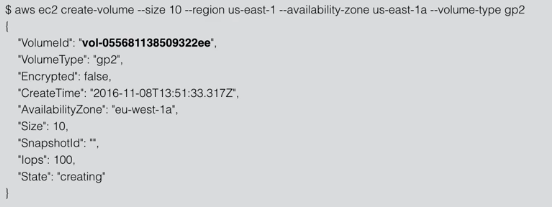
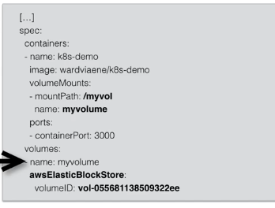
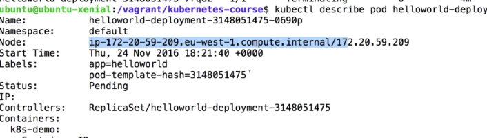
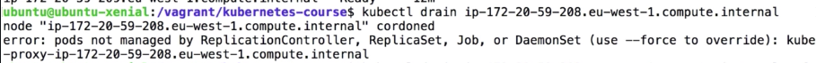

# Create volumes

- Volumes to store data outside the container.
- When container stops, all data on the container itself is lost.
- App that's don't keep a local state, but store their state in external service
- External service like a database, caching server (MQSQL, S3)
- Persistent Volumes allow you to attach a volume to a container that will 
  exists even when the container stops
- Volume can be attached using different volume plugins 



## Failover 

If node stops working, the pod can be rescheduled on another node, and volume can be 
attached to new node.



Once node1 fail,



This only work only when nodes are in the same AZ (aws)

## Create Volume in AWS

```
aws ec2 create-volume --size 10 --region your-region --availability-zone your-zone --volume-type gp2 --tag-specifications 'ResourceType=volume, Tags=[{Key= KubernetesCluster, Value=kubernetes.domain.tld}]'
```


Note: the Id returned will be reference in the volume definition inside the pod

Inside the pod defintion




## Test how it works
**(This require two nodes so may need to work in the cloud environment)**

1. Create the deployment using helloworld-with-volume.yml
```
spec:
  containers:
  - name: k8s-demo
    image: wardviaene/k8s-demo
    ports:
    - name: nodejs-port
      containerPort: 3000
    volumeMounts:
    - mountPath: /myvol
      name: myvolume
  volumes:
  - name: myvolume
    awsElasticBlockStore:
      volumeID: # insert AWS EBS volumeID here
```
2. Once deployment done, Go into the pod and create a file under /myvol

        kubectl exec <pod_name> -i -t -- bash
        echo "a" > /myvol/a.txt     
  
    Then exit  
  
3. Describe the pod and find its node id
    
4. Drain the node, so any pod existing on it is to be migrated.

        kubectl drain <node id>
   
   
 
5. Wait a moment for another pod to be bring up in another node

6. Run step 2 again but now check if the file created still exists.

7. Describe the pod again and see the volume is attached to the node    
    